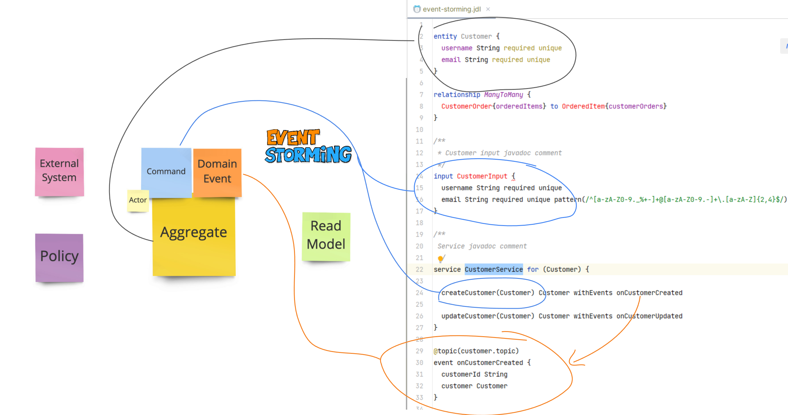

ZenWave Domain Model Language
=====================================

> Since version 1.4.0 groupId was changed to `io.zenwave360.sdk`

ZDL is a Domain Specific Language (DSL) for Event-Driven Architectures. With Domain Driven Design principles built-in, it can be used to map the discoveries of an [EventStorming](https://www.eventstorming.com/) session.

- Designed to be developer friendly, with a simple and compact syntax.
- It retains the language of the business process discoveries found in Event-Storming sessions.
- And because it's machine-friendly it can be parsed and converted into multiple software artifacts like: 
  - documentation, drawings, API definitions like OpenAPI and AsyncAPI v2/v3 and multiple backend implementations and its tests.

Further reading:
- [ZDL Domain Language Reference](https://zenwave360.github.io/docs/event-driven-design/zenwave-domain-language)
- [ZenWave SDK](https://zenwave360.github.io/zenwave-sdk/)
- [ZenWave Editor for IntelliJ](https://zenwave360.github.io/plugin/)

